# Exercices - TP1

## Nomenclatures

---

### Commits

- **Comment?** ```git commit -m "[#ISSUE_NUMBER] - Commentaire pertinent" ```
- **Quoi?** Toute la issue.
- **Quand?** à la fin d'une issue.

### Code

- S'assurer que le code soit en anglais.
- Analyse de formattage par Prettier.

## Stratégie de branches

---

### Branches de base

- **master** (principale) -> branche de remise (à sécuriser).
- **dev** -> branche de mise en commun/merge (défaut).
- **feature_branch** -> créer la branche à partir d'une issue.

Une fois la feature terminée, prendre l'habitude de "pull" les derniers changements sur la branche **dev** avant de commit ses propres changements sur sa **feature_branch** afin de s'assurer qu'il n'y ait aucun conflits de code. 

Par la suite, faire un commit selon les normes établies plus haut et pousser sur sa **feature_branch**. Créer ensuite une "Pull Request" directement dans GitHub qui utilise **base:dev** et **compare:TA_FEATURE_BRANCH**.

La revue de code sera assignée automatiquement à tous les membres de l'équipe et une personne, autre que celle qui à créer la Pull Request, devra faire la revue et accepter celle-ci.

S'assurer que la bonne issue est associée à la Pull Request.

## Analyse de formatage

---
Prettier pour Java, soit prettier-maven-plugin, est utilisé comme outil d'analyse du formatage du code.

### Configuration
- **.prettierrc** : Fichier de configuration de Prettier. Seuls les fichiers .java des répertoires src/main et src/test sont analysés. Ce fichier de configuration écrase les valeurs présentes dans le fichier de configuration pom.xml.
- **.prettierignore** : Fichier d'exclusion de Prettier. Par mesure de sécurité, les autres répertoires et autres types de fichiers sont exclus, advenant une modification ultérieure des fichiers .prettierrc ou pom.xml.

### Formatage du code avec Prettier (goal Maven)
```
mvn prettier:write -f pom.xml
```

### Vérification du formatage (goal Maven)
Un message d'erreur est affiché si le code n'est pas adéquatement formaté. Exécuter la commande de formatage, le cas échéant.
```
mvn prettier:check -f pom.xml
```

### Affichage des arguments de Prettier (goal Maven)
```
mvn prettier:print-args -f pom.xml
```

## Déclaration d'utilisation de l'IA

---

Le fichier .prettierignore est adapté des recherches de documentation effectuées par Chat GPT, pour configurer prettier-maven-plugin avec Java. L'information retenue est essentiellement celle présente dans la documentation officielle de Prettier et de Maven.

## Screenshots

### Github Project

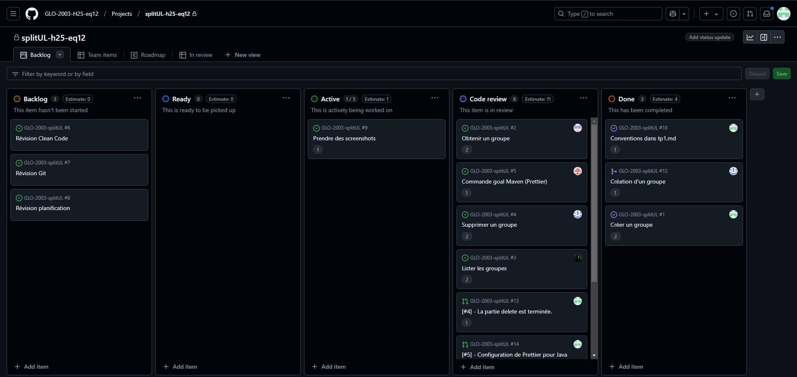

### Milestone

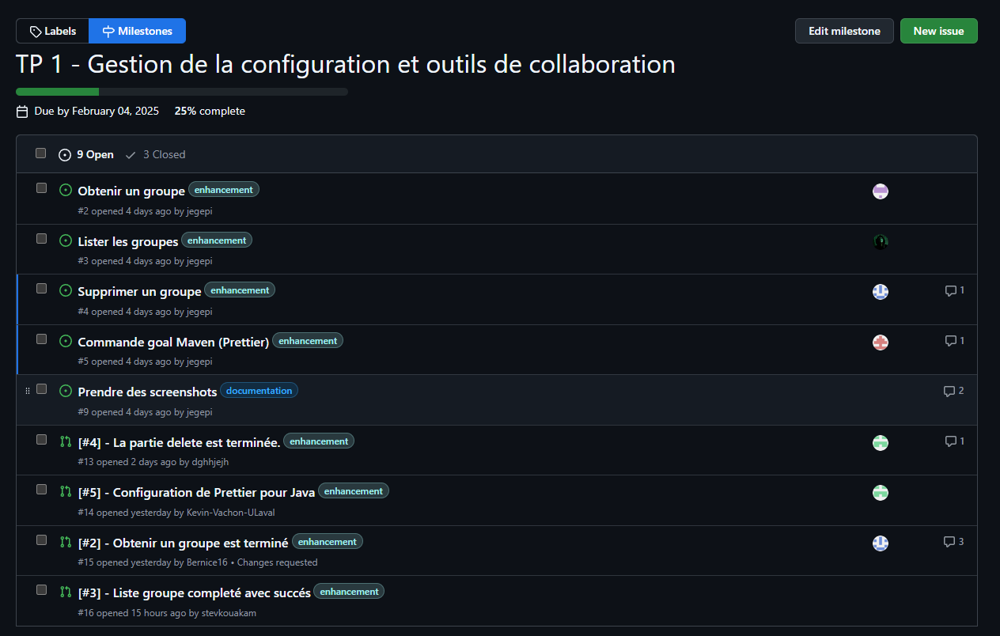
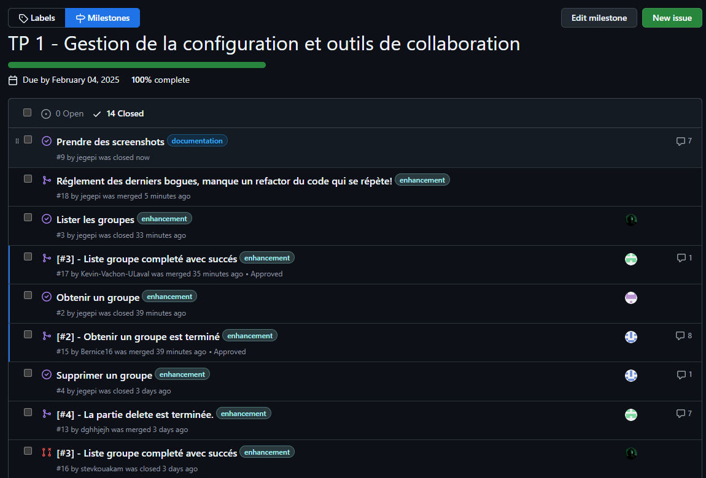

### Issues

Issue 1
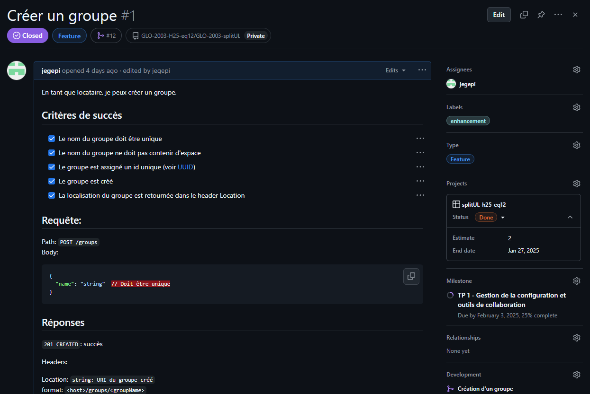

Issue 2
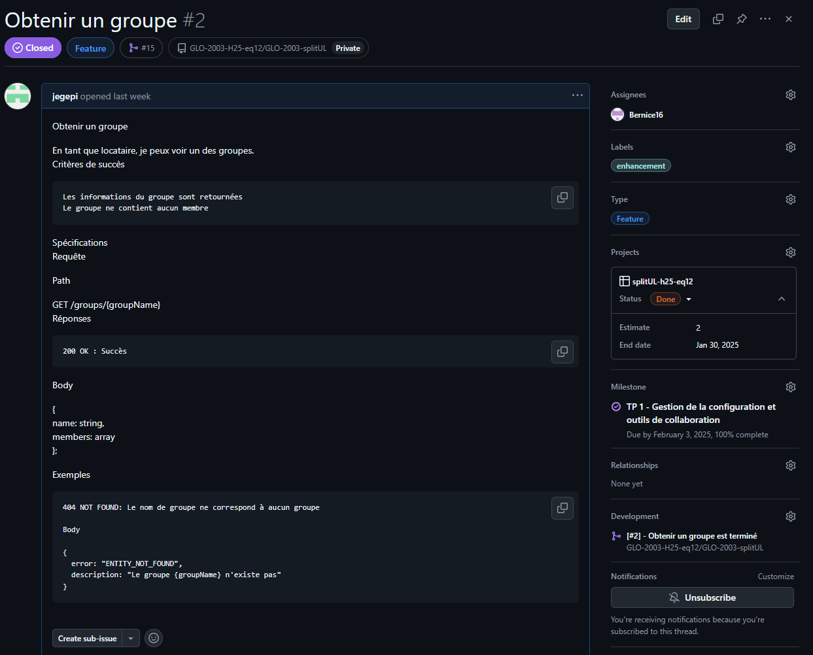

Issue 3
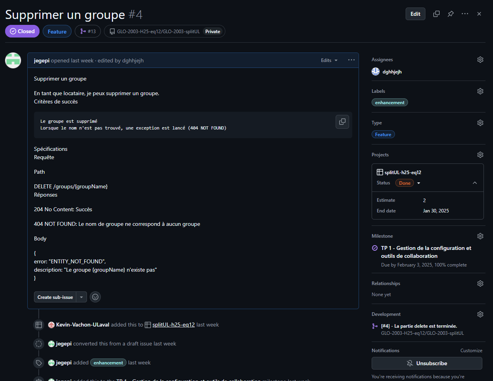

### Pull Requests

Pull Request 1
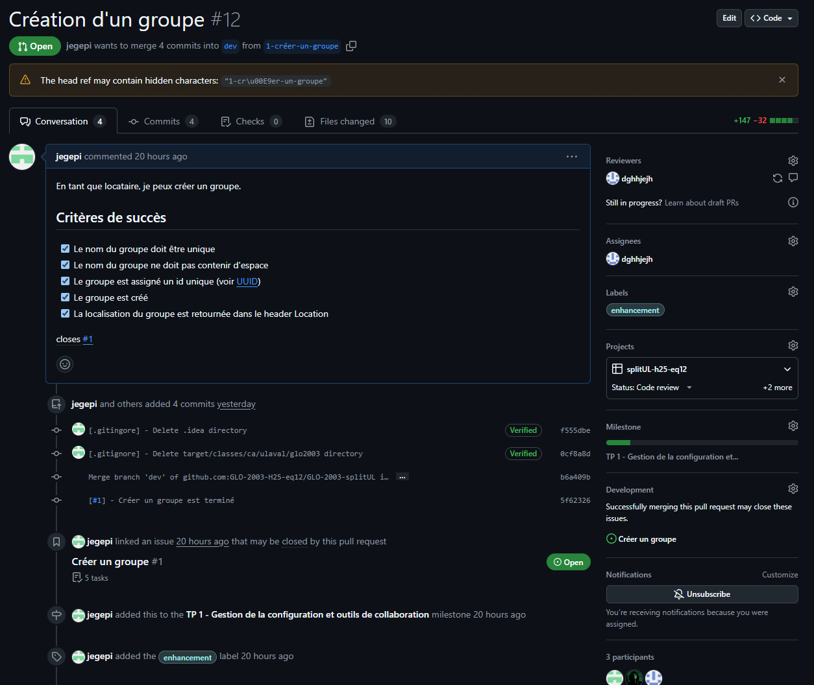
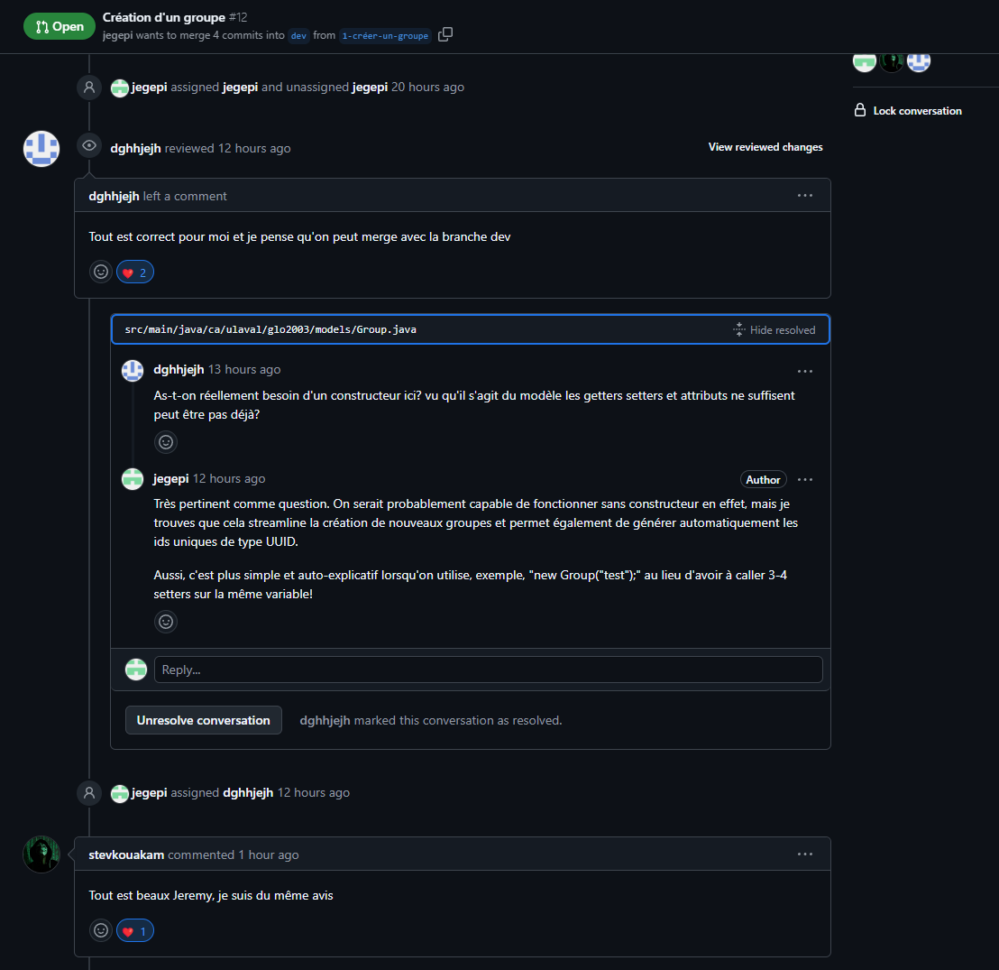

Pull Request 2
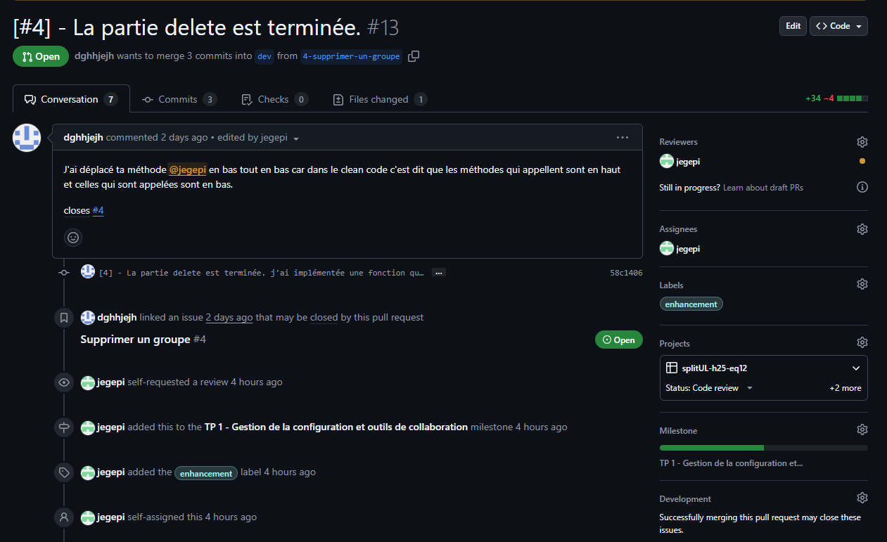
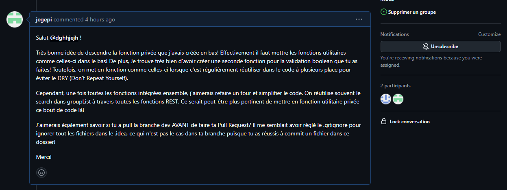

Pull Request 3
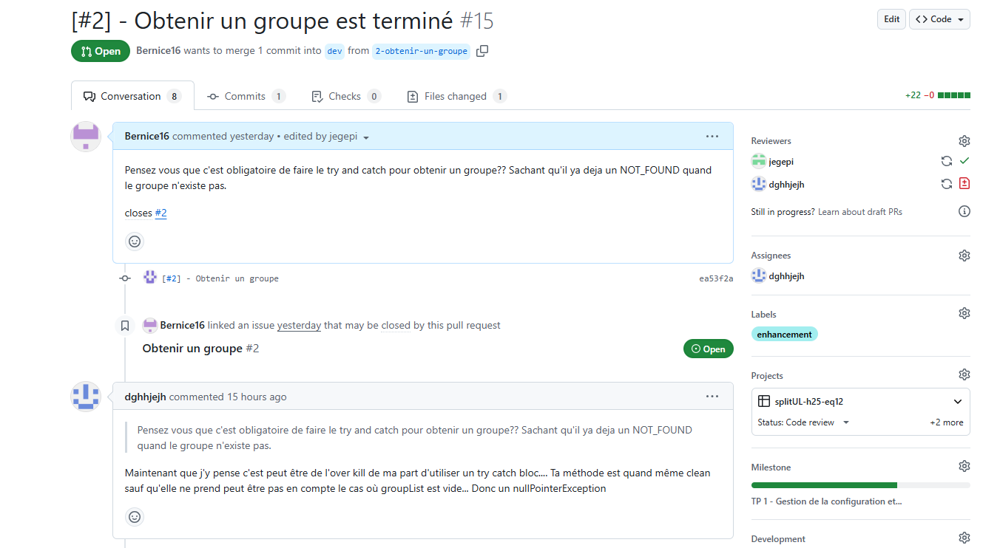
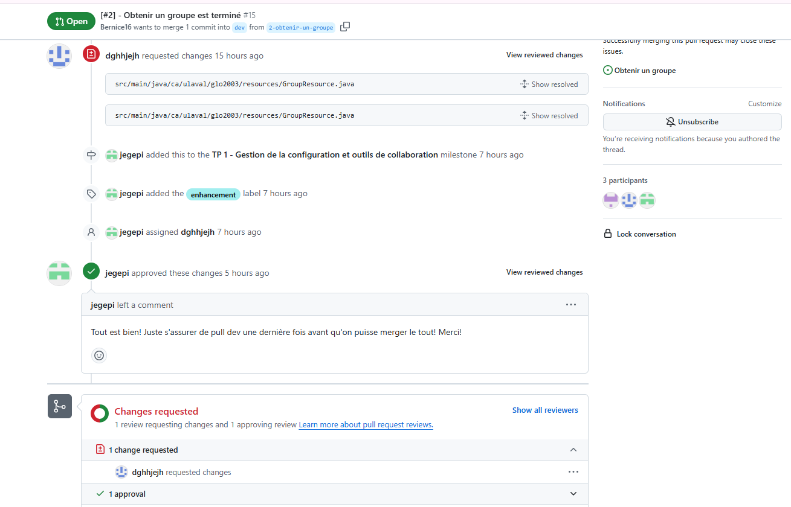

### Git Tree

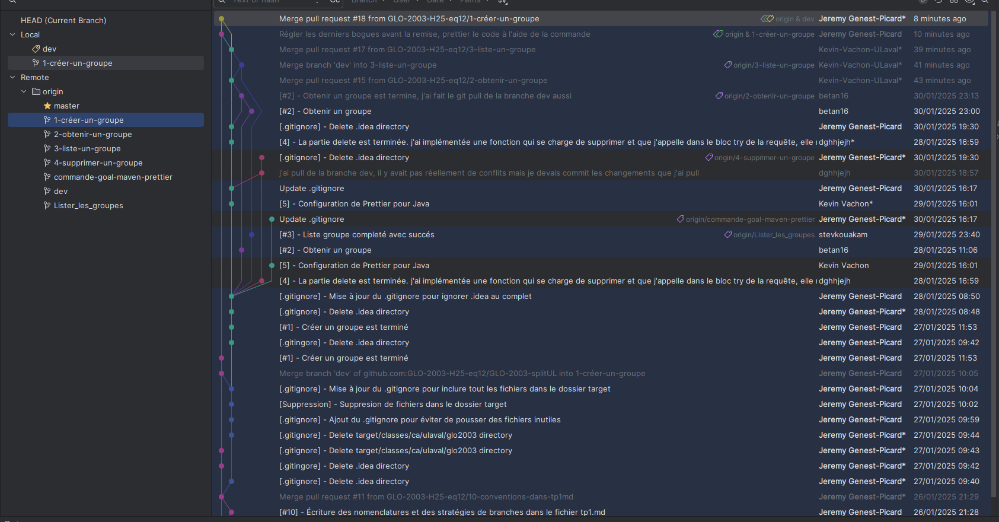
