# Exercices - TP2

## Architecture

### Choix d’architecture
Afin de respecter les contraintes de l’API et les requis, nous avons choisi une architecture en couches pour séparer la logique de domaine de l’API. Les clases principales (Member, Group et Expense) ont un contrôleur « Resource » (ex. ExpenseResource), une requête « Body » (ex. ExpenseBody) et une réponse (ex. ExpenseResponse).

### Améliorations potentielles
Le schéma théorique des features ne reflète pas totalement l’architecture réelle des classes, puisqu’une partie des couches est implémentée par Jersey. D’un point de vue relations suspectes, il serait important de refactoriser pour que l’architecture en couche soit mieux définie. Cependant, il ne semble pas y avoir de problématique fonctionnelle ou conceptuelle majeure.

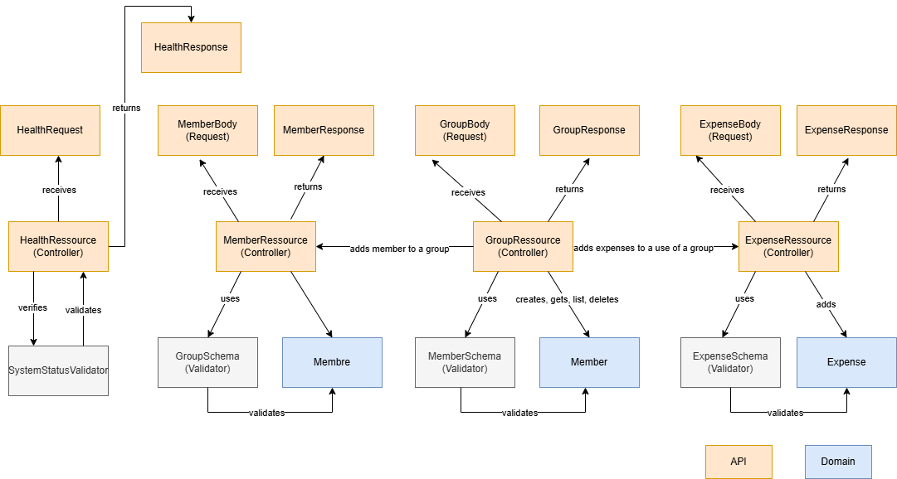

## Rétrospective sur le processus

### Performance de l'itération TP1
| Métrique                                                  | Moyenne | Minimum | Maximum |
|-----------------------------------------------------------|---------|---------|---------|
| Temps pour implémenter une issue                          | 5 jours | 1 jours  | 14 jours |
| Temps pour intégrer une pull-request (review + correctifs) | 3 jours | 1 jours | 10 jours  |
| Nombre de personnes travaillant sur une issue             | 1 | 1 | 1 |
| Nombre de personnes revisant chaque pull-request          | 1 | 1 | 1 |
| Nombre d'issues en cours d'implémentation en même temps   | 5 | 1 | 5 |
| Nombre de pull-requests en cours de review en même temps  | 2 | 1 | 3 |

### Réflexions d'équipe

1. Selon vous, est-ce que les issues/pull-requests prenaient trop de temps à être terminées? Ou pas assez? Quel serait le temps idéal (approximatif) pour chacun?
   - Les issues prenaient trop de temps à être terminées. Bien que le projet ne soit pas fait à temps plein, un temps idéal serait de 5 jours ou moins. La taille des issues et la portée du projet cadreraient bien avec une fréquence de sprint hebdomadaire.
2. Quel est le lien entre la taille de ces issues/pull-requests et le temps que ça prenait à les terminer?
   - Plus les issues et les PR sont grosses, plus ça prend de temps pour les terminer. Une issue plus grande prend aussi plus de temps à intégrer, tester, uniformiser et refactoriser si requis.
3. Donnez au moins 3 trucs pour améliorer votre processus (tailles des issues/pr, communication, code reviews, uniformisation, etc.)
   - Diminuer la taille des issues pour intégrer plus rapidement. Le goulot d'étranglement était le codage des tests.
   - Améliorer la communication de l'architecture, en particulier au niveau des précédences et des interdépendances entre les issues (i.e. Certaines étapes sont chaînées et demandent un ordre précis, même si la méthodologie est itérative).
   - Avoir une meilleure uniformité des classes et des tests, afin d'éviter des réusinages de code intempestifs. Faire des commits plus fréquents aiderait à identifier plus rapidement les divergences entre les issues.

## Déclaration d'utilisation de l'IA

L'IA m'a aidé pour la récupération des dettes associées à chaque membre d'un groupe en me proposant d'utiliser une Map<String, Double> pour stocker les dettes.

## Screenshots

### Github Project

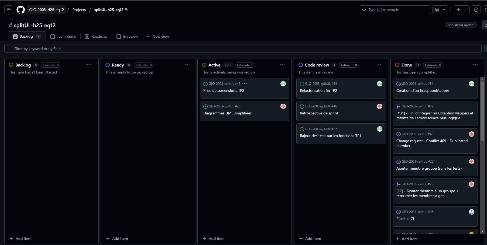

### Milestone

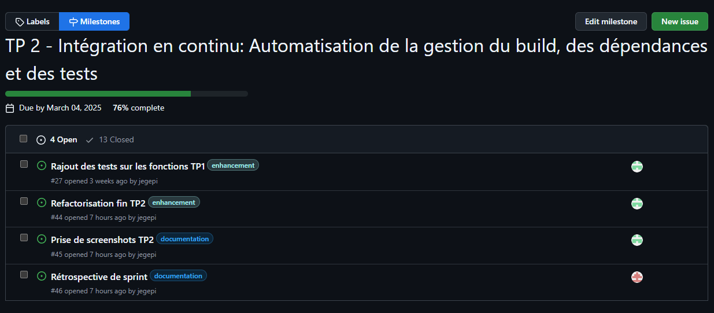

### Issues

Issue 1
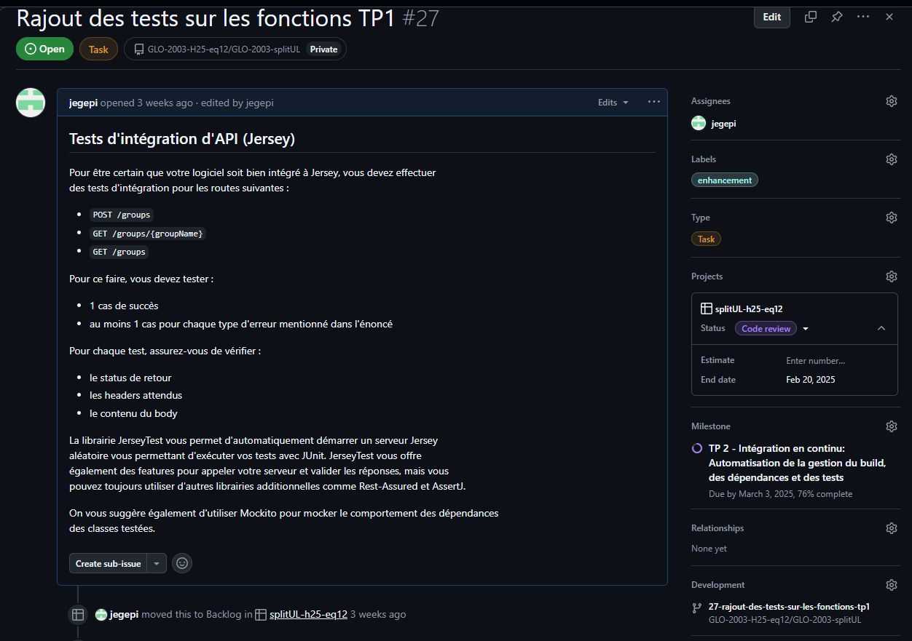

Issue 2
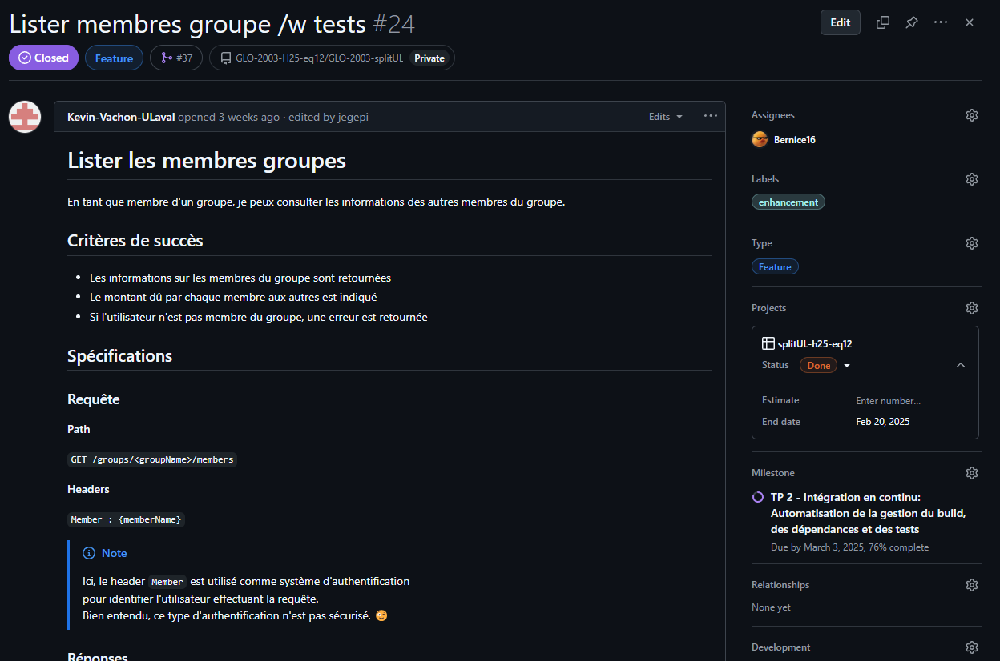
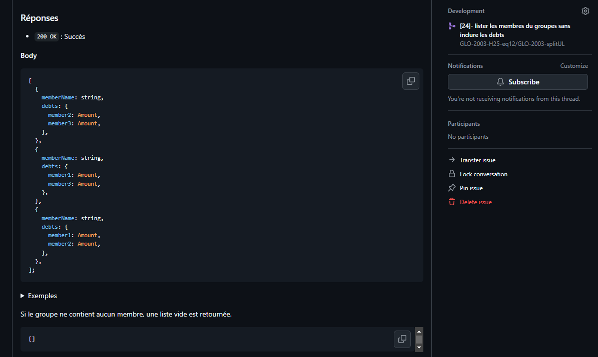

Issue 3
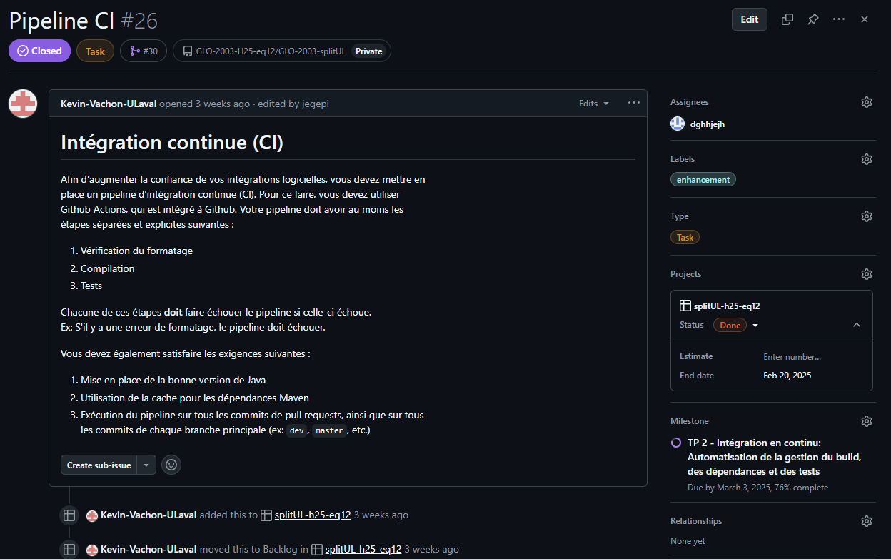

### Pull Requests

Pull Request 1
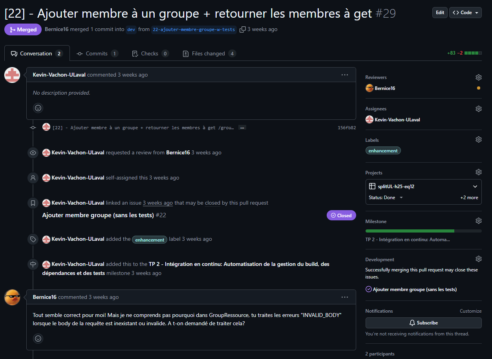
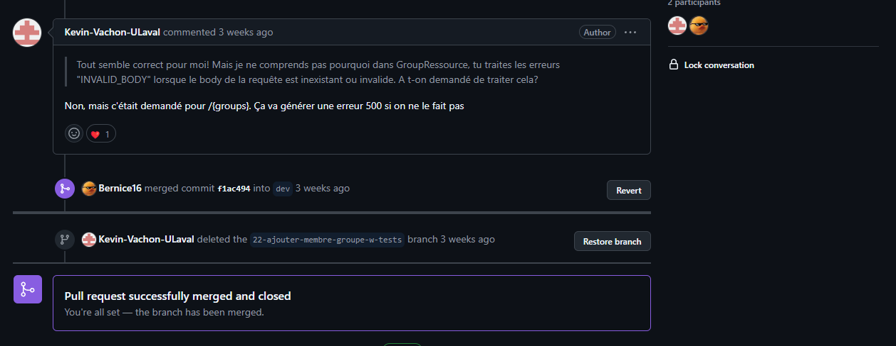

Pull Request 2
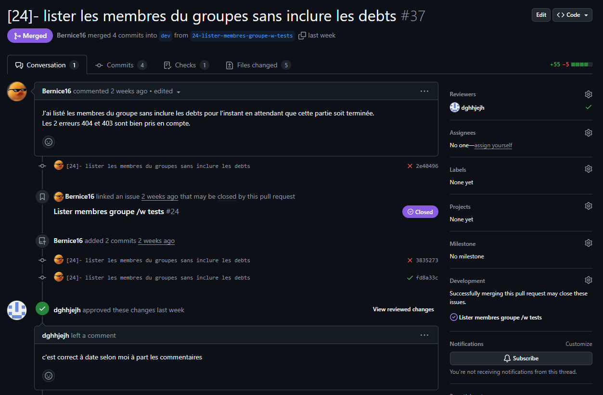

Pull Request 3
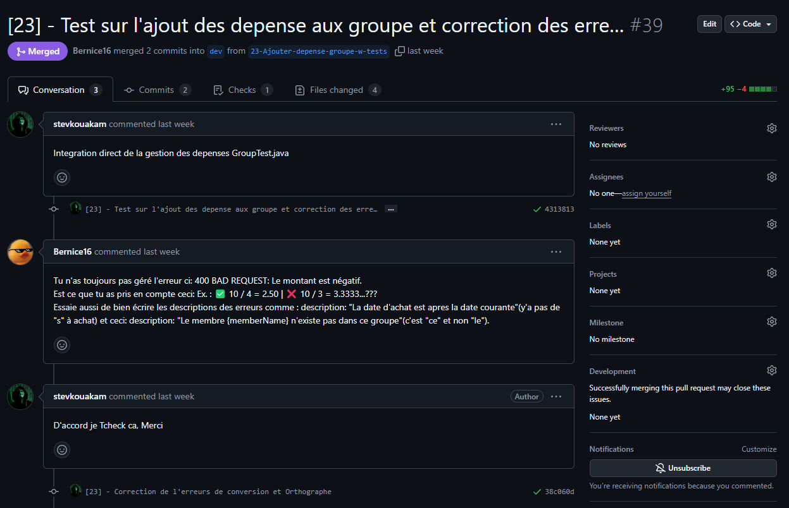

### Git Tree

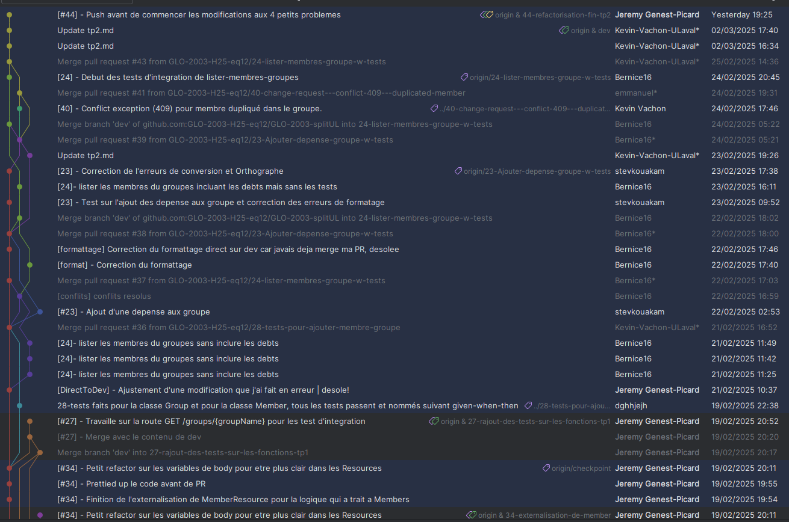
