# Exercices - TP3

## Propositions de Récits Utilisateurs

### 1. En tant que membre d’un groupe, je peux filtrer l’historique de dépenses d’un groupe par nom de membre

---

#### Critères de succès

- Le total des dépenses ajoutées par le membre est retourné
- La liste des dépenses est retournée en ordre chronologique décroissant, en fonction de la date d'achat.
- Le membre doit être authentifié et faire partie du groupe pour accéder aux dépenses du membre dont on veut avoir les dépenses.
- Si le membre particulier n'a pas de dépenses, une liste vide doit être retournée.

#### Requête:
GET ```/groups/:groupName/expenses/:memberName```
#### Headers:
Member: ```memberName```
#### Réponses:
### **200 OK**

---
Si les membres spécifiés font parti du groupe. Retourne le total et les dépenses du membre dans l'URI en ordre chronologique décroissant. Retourne une liste vide si le membre spécifié dans l'URI n'a aucune dépense à son nom.
### **403 FORBIDDEN**

---
Si le membre dans le Header n'existe pas dans le groupe
- error: "FORBIDDEN"
- message: "Vous n'êtes pas membre du groupe"
### **404 NOT FOUND**

---
Si le groupe n'existe pas
- error: "ENTITY_NOT_FOUND"
- message: "Le groupe :groupName n'existe pas"
### **404 NOT FOUND**

---
Si le membre n'existe pas dans le groupe
- error: "ENTITY_NOT_FOUND"
- message: "Le membre :membreName n'existe pas dans ce groupe"

### 2. En tant que membre d’un groupe, je peux supprimer une de mes dépenses.

---

#### Critères de succès

- La dépense est supprimée
- Les dettes sont recalculées en conséquence

#### Requête:
DELETE ```/groups/:groupName/expenses/:expenseId```
#### Headers:
Member: ```memberName```
#### Réponses:
### **204 No Content**

---
Si le membre spécifié fait parti du groupe. Supprime la dépense et ajuste les dettes avec succès.
### **403 FORBIDDEN**

---
Si le membre dans le Header n'existe pas dans le groupe
- error: "FORBIDDEN"
- message: "Vous n'êtes pas membre du groupe"
### **404 NOT FOUND**

---
Si le groupe n'existe pas
- error: "ENTITY_NOT_FOUND"
- message: "Le groupe :groupName n'existe pas"
### **404 NOT FOUND**

---
Si la dépense n'existe pas
- error: "ENTITY_NOT_FOUND"
- message: "La dépense :expenseId n'existe pas"

### 3. En tant que membre d’un groupe, je veux renommer un groupe.

---

#### Critères de succès

- Le nom est mis à jour s'il est unique et sans espaces.
- Le nouvel URI est retourné dans le header Location

#### Requête:
PUT ```/groups/:groupName```
#### Headers:
Member: ```memberName```
#### Body:
```
{
    "newName": "NouveauNomDuGroupe"
}
```
#### Réponses:
### **200 OK**

---
Si le membre spécifié fait parti du groupe. Met à jour le nom du groupe.
### **403 FORBIDDEN**

---
Si le membre dans le Header n'existe pas dans le groupe
- error: "FORBIDDEN"
- message: "Vous n'êtes pas membre du groupe"
### **404 NOT FOUND**

---
Si le groupe n'existe pas
- error: "ENTITY_NOT_FOUND"
- message: "Le groupe :groupName n'existe pas"
### **400 BAD_REQUEST**

---
Si le nouveau nom contient des espaces
- error: "BAD_REQUEST"
- message: "Le nom contient des espaces"
### **409 CONFLICT**

---
Si le nouveau nom est déjà utilisé
- error: "CONFLICTING_PARAMETER"
- message: "Le nom est déjà utilisé par un autre groupe"

### 4. En tant que membre d’un groupe, je veux me renommer.

---

#### Critères de succès

- Mon nom est mis à jour.
- Les dépenses qui m'appartenaient sont mise à jour avec mon nouveau nom.
- Les dettes qui m'étaient dûes sont mise à jour avec mon nouveau nom.

#### Requête:
PUT ```/groups/:groupName/members/:memberName```
#### Headers:
Member: ```memberName```
#### Body:
```
{
    "newName": "NouveauNomDuMembre"
}
```
#### Réponses:
### **204 No Content**

---
Si les membres spécifiés font parti du groupe et qu'ils sont identiques. Met à jour le nom du membre.
### **403 FORBIDDEN**

---
Si le membre dans le Header n'existe pas dans le groupe
- error: "FORBIDDEN"
- message: "Vous n'êtes pas membre du groupe"
### **409 CONFLICT**

---
Si le membre n'est pas le même que le header
- error: "CONFLICTING_PARAMETER"
- message: "Le membre :memberName n'est pas le même que dans le Header Membre"
### **400 BAD_REQUEST**

---
Si le nouveau nom contient des espaces
- error: "BAD_REQUEST"
- message: "Le nom contient des espaces"
### **409 CONFLICT**

---
Si le nouveau nom est déjà utilisé
- error: "CONFLICTING_PARAMETER"
- message: "Le nom est déjà utilisé par un autre dans le groupe"

## Retrospective

### Pipeline CI

#### 1. Avant l'implémentation du pipeline de tests automatisés, combien de temps passiez-vous à vérifier et tester manuellement le code lors des intégrations et des remises ?

---

Nous passions au moins 30 minutes à 1 heure par remise à tester manuellement le code, en plus de passer une quinzaine de minutes à tester manuellement après chaque intégration d’une Pull Request. Les tests étaient faits en parallèle par plusieurs membres du groupe, afin d’en assurer la validité.

#### 2. Après l'implémentation du CI, combien de temps passez-vous à effectuer ces vérifications ?

---

Les tests sont maintenant automatisés et prennent moins de 5 minutes à s’exécuter de façon automatisée. Les vérifications manuelles se limitent aux tests en cours de développement, et avec des outils tels que Postman pour assurer la validité des tests unitaires et d’intégration.

#### 3. Quels sont les points positifs que le CI a apportés à votre processus? Donnez-en au moins trois.

---

- **Gain d’efficience** : Les tests sont exécutés automatiquement en moins de 5 minutes, ce qui permet d’éliminer la redondance de tests manuels par plusieurs membres de l’équipe.
- **Détection précoce des erreurs** : Les erreurs sont repérées dès l’intégration du code dans la branche `dev`. Ceci permet de prendre action rapidement, dès qu’un problème est découvert.
- **Uniformité et fiabilité** : Le pipeline garantit que les tests et les validations sont effectués systématiquement et dans un environnement normalisé. Les tests manuels peuvent manquer de rigueur et être exécutés dans des environnements différents de celui de production (i.e. l’environnement du développeur).

#### 4. Le pipeline CI introduit-il un élément qui pourrait devenir négatif ou risqué pour le processus, le produit et/ou l'équipe? Justifiez votre réponse.

---

Oui. Un pipeline CI peut avoir des impacts négatifs ou introduire des risques. Des tests exécutés automatiquement peuvent donner l’impression que le produit logiciel est sans bug ou sans effet de bord — il faut rester critique par rapport à la couverture des tests et à la probabilité que des bugs latents puissent exister dans des contextes non testés. De plus, un pipeline CI peut bloquer le processus d’intégration pour des raisons techniques complexes. Il est aussi important de contrôler et de mesurer les temps d’exécution et l’utilisation des ressources, puisque le pipeline CI pourrait engendrer des coûts importants de façon erratique.


### Tests

#### 1. Quelle proportion de temps passez-vous à implémenter le code fonctionnel par rapport aux tests? Cette proportion évolue-t-elle avec le temps? Pourquoi?

---

Au début, environ 90 % du temps était consacré au code fonctionnel et 10 % aux tests. Avec l'expérience au fil des semaines de cours et de l'automatisation des tests, cette proportion change en donnant plus de poids aux tests, autour de 60 % code fonctionnel / 40 % tests. Ceci s’explique par une amélioration des pratiques d’intégration et une prise de conscience quant à l’importance de bien tester le code, d’autant plus que la complexité du projet est croissante de remise en remise.

#### 2. L'implémentation des tests augmente naturellement la charge de travail. Comment cela a-t-il affecté votre processus? (ex. : taille des issues/PRs, temps d'implémentation, planification, etc.)

---

Les issues et PRs ont augmenté en taille, puisque la quantité de code de tests augmente. Au début, cela demandait plus de temps de planification et de codage. Par la suite, ça a au contraire diminué le temps total, puisqu’il y avait moins de temps consacré au débogage et aux problèmes d’intégration. Les bugs et problèmes d’intégration sont aussi moins complexes à résoudre, puisqu’ils sont dépistés plus tôt.

#### 3. Avez-vous davantage confiance en votre code maintenant que vous avez des tests? Justifiez votre réponse.

---

Oui, la confiance a augmenté globalement par rapport au code. En particulier quant aux effets de bord et aux régressions potentielles. La couverture de tests étant plus large, nous sommes plus à l’aise de la solidité du code après une refactorisation.

#### 4. Que pouvez-vous faire pour améliorer la qualité de vos tests? Donnez au moins trois solutions.

---

- **Écrire des tests pour plus de cas** afin de couvrir à la fois les cas normaux et les cas limites. Une variété de tests est importante, puisque l’utilisateur final pourrait entrer des valeurs plus variées que les cas usuels et limites anticipés par le développeur.
- **Assurer une maintenance des tests existants**, en particulier après une refactorisation ou après l’ajout de nouvelles fonctionnalités. Revoir périodiquement l’ensemble des tests, afin de s’assurer que le contexte est toujours approprié. Ceci évitera d’avoir une fausse assurance après une exécution réussie du pipeline CI.
- **Miser sur les tests d’intégration en plus des tests unitaires.** Les bugs latents et les effets de bord potentiels complexes viennent de l’interaction des parties testées unitairement. L’ensemble du système est plus complexe que la somme de ses parties individuelles.

## Déclaration d'utilisation d'IA

Claude AI a été utilisé afin de déboguer le cd, j'avais pris le code sur github actions, adapté par rapport aux requis, mais cela ne se déployait pas à cause d'une erreur de build que je ne comprenais pas.

ChatGPT a été utilisé a plusieurs reprise pour comprendre et diagnostiquer les bogues liés fonctionnalites Header d'authentification et suppression d'un groupe. Ces interventions ont permis d'eclaicir certains comportement du code que je ne comprenais pas.  

## Screenshots

### Diagramme

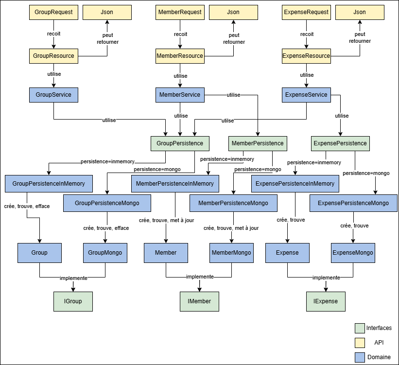

### Github Project

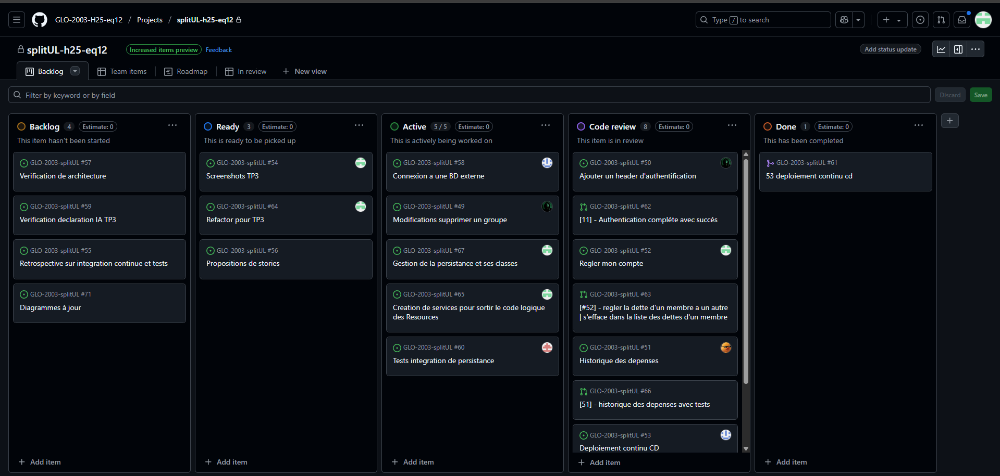

### Milestone

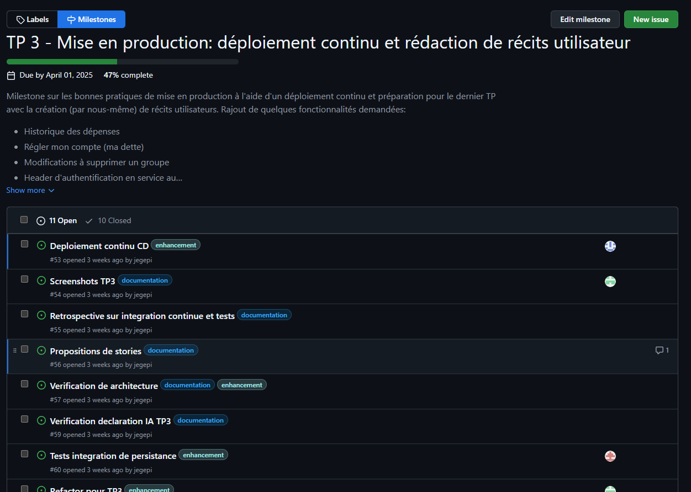

### Issues

Issue 1
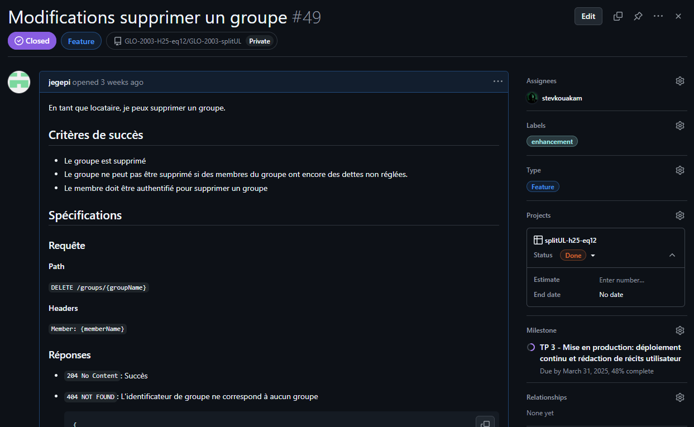
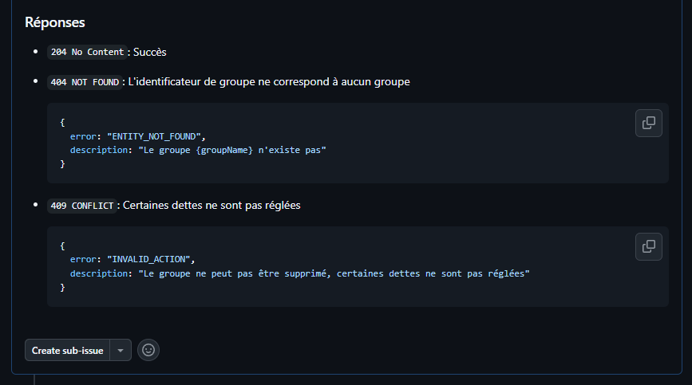

Issue 2
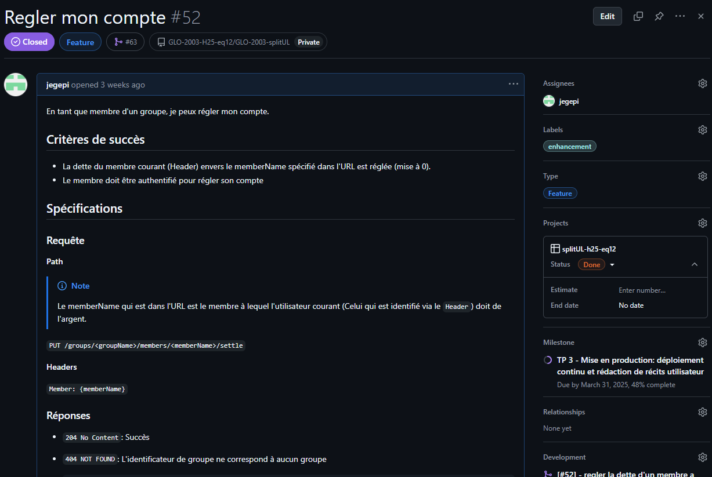
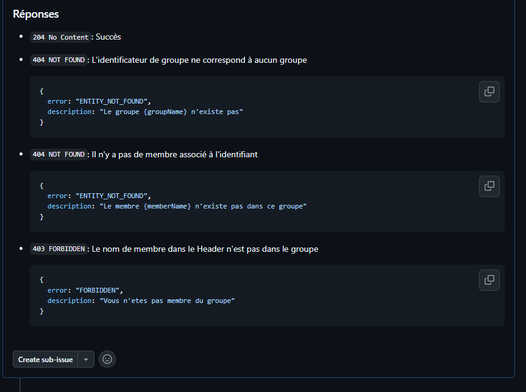

Issue 3
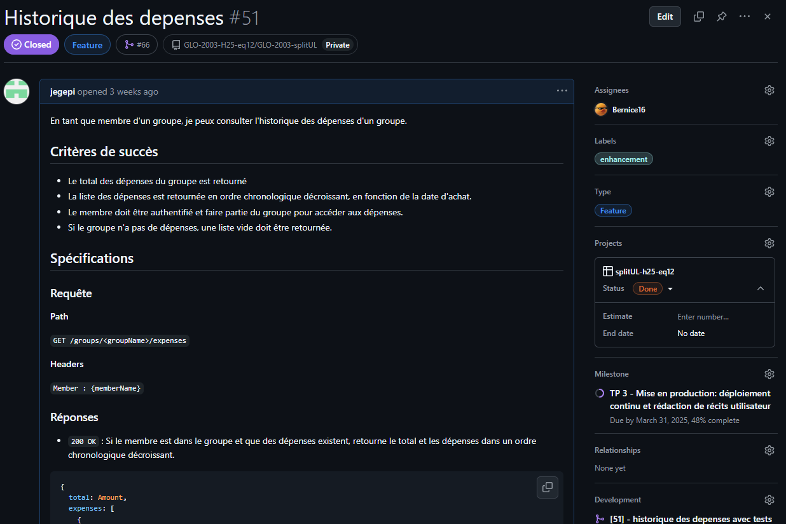
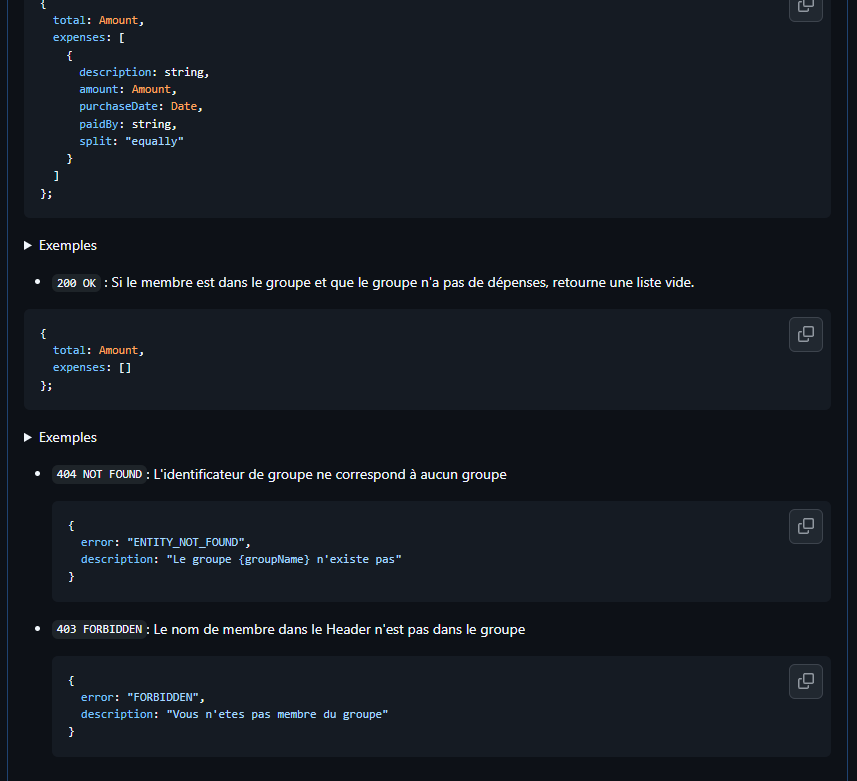

### Pull Requests

Pull Request 1
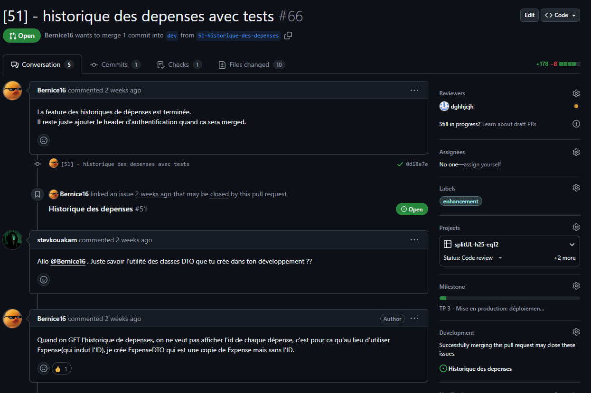
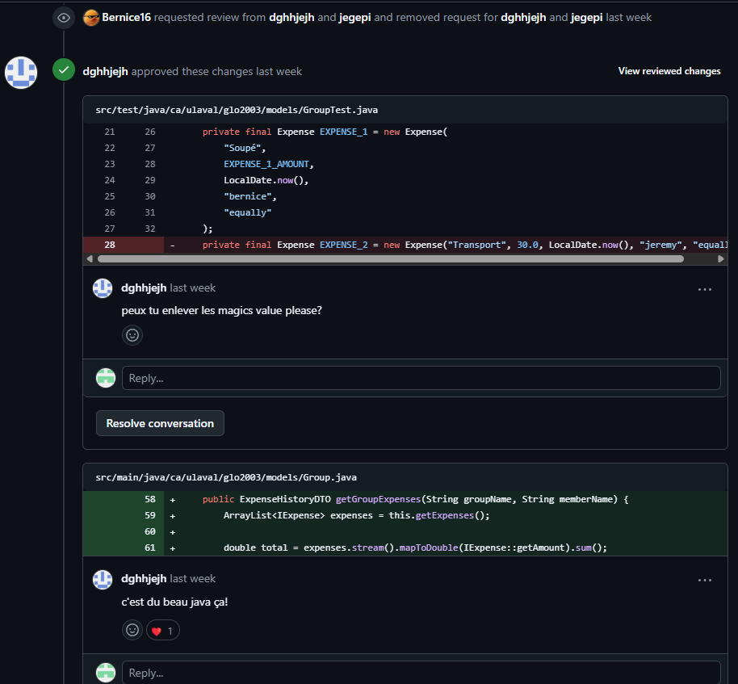

Pull Request 2
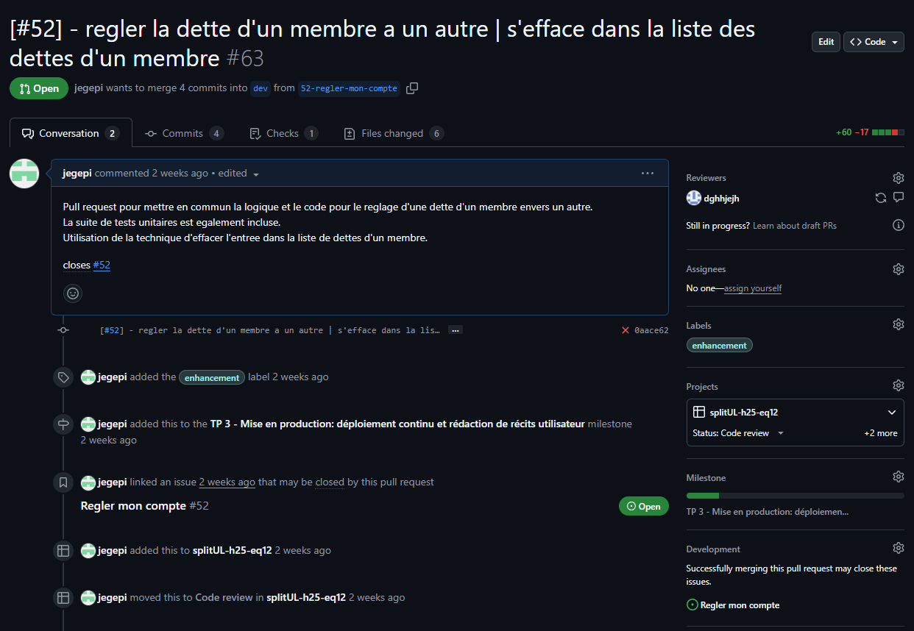
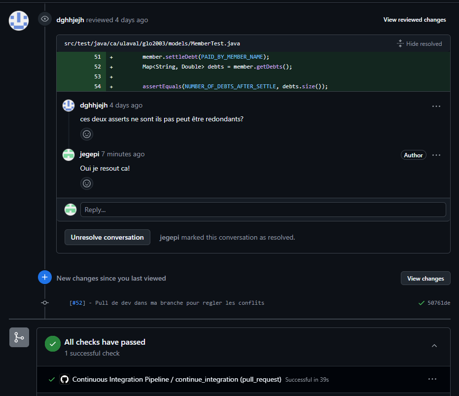

Pull Request 3
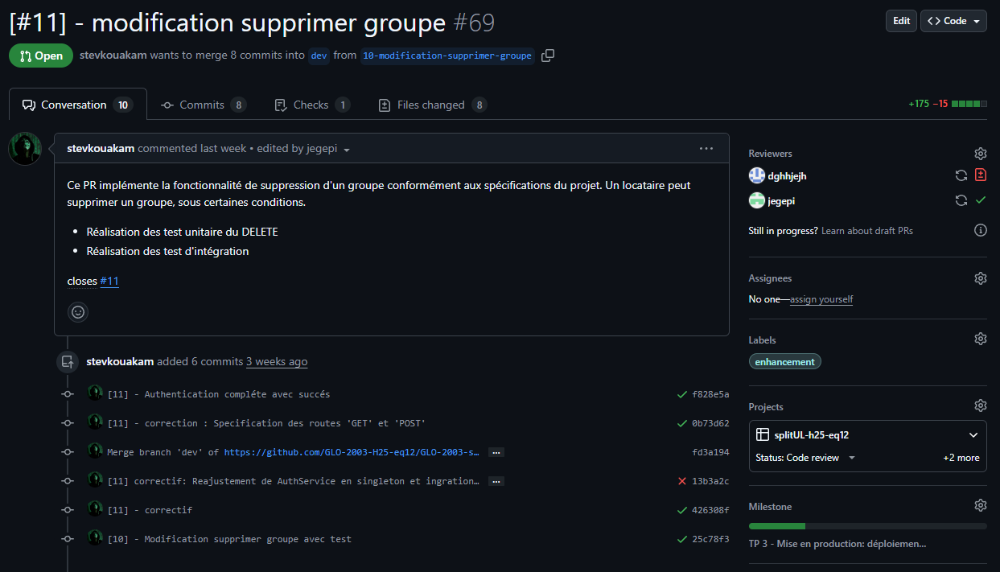
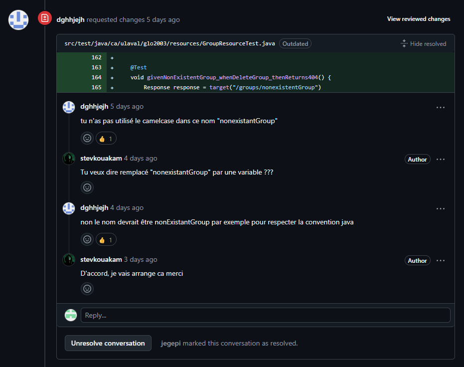

### Git Tree

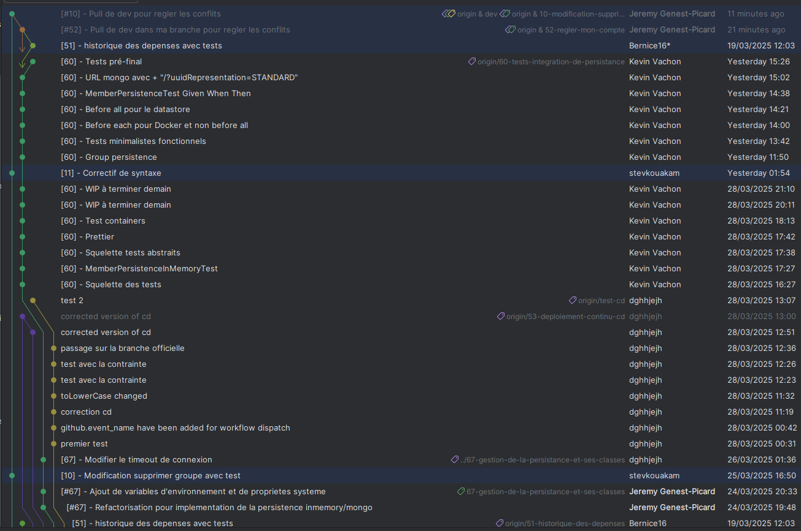
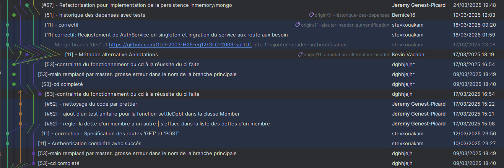
